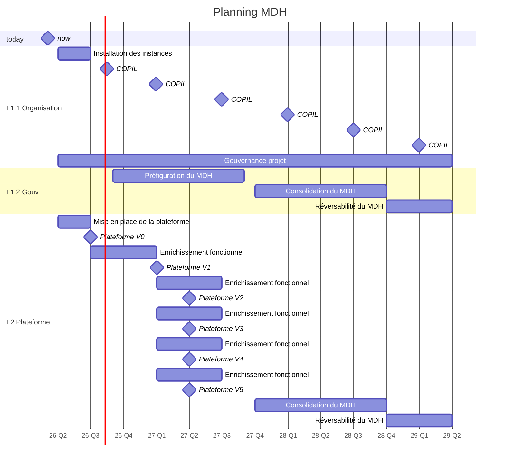

# test

```mermaid
gantt
    title Planning MDH
    dateFormat YYYY-MM-DD
    axisFormat %y-Q%q
    tickInterval 3month

    section today
        %% This task forces the chart to start at the beginning of the year
        now : milestone, m1, 2026-03-04, 0d

    section L1.1 Organisation
        Installation des instances           :a1, 2026-04-01, 3M
        COPIL                                :milestone, 2026-09-30
        COPIL                                :milestone, 2027-03-31
        COPIL                                :milestone, 2027-09-30
        COPIL                                :milestone, 2028-03-31
        COPIL                                :milestone, 2028-09-30
        COPIL                                :milestone, 2029-03-31
        Gouvernance projet                   :2026-04-01, 36M
        
    section L1.2 Gouv
        Préfiguration du MDH                 :2026-09-01, 12M
        Consolidation du MDH                 :2027-10-01, 12M
        Réversabilité du MDH                 :2028-10-01, 6M

    section L2 Plateforme
        Mise en place de la plateforme       :2026-04-01, 3M
        Plateforme V0                        :milestone, 2026-07-01
        Enrichissement fonctionnel           :6M
        Plateforme V1                        :milestone, 2027-01-01
        Enrichissement fonctionnel           :6M
        Plateforme V2                        :milestone, 2027-01-01
        Enrichissement fonctionnel           :6M
        Plateforme V3                        :milestone, 2027-01-01
        Enrichissement fonctionnel           :6M
        Plateforme V4                        :milestone, 2027-01-01
        Enrichissement fonctionnel           :6M
        Plateforme V5                        :milestone, 2027-01-01
        Consolidation du MDH                 :2027-10-01, 12M
        Réversabilité du MDH                 :2028-10-01, 6M
```
