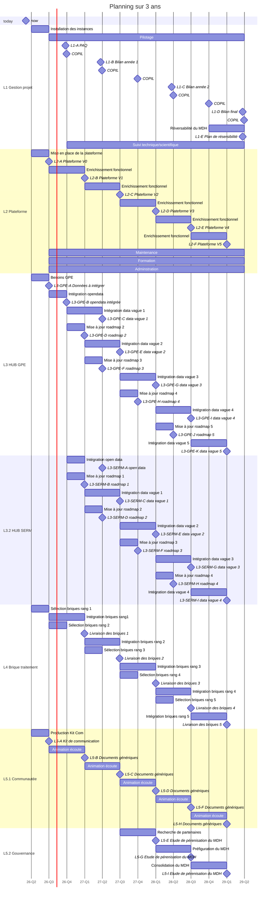

# Mobility Data Hub (MDH)

```mermaid
gantt
    title Planning sur 3 ans
    dateFormat YYYY-MM-DD
    axisFormat %y-Q%q
    tickInterval 3month

    section today
        %% This task forces the chart to start at the beginning of the year
        now : milestone, m1, 2026-03-04, 0d

    section L1 Gestion projet
        Installation des instances           :a1, 2026-04-01, 3M
        Pilotage                             :2026-07-01, 33M
        L1-A PAQ                             :milestone, 2026-09-23, 1m
        COPIL                                :milestone, 2026-09-30, 1m
        L1-B Bilan année 1                   :milestone, 2027-03-23, 1m
        COPIL                                :milestone, 2027-03-31, 1m
        COPIL                                :milestone, 2027-09-30, 1m
        L1-C Bilan année 2                   :milestone, 2028-03-23, 1m
        COPIL                                :milestone, 2028-03-31, 1m
        COPIL                                :milestone, 2028-09-30, 1m
        L1-D Bilan final                     :milestone, 2029-03-23, 1m
        COPIL                                :milestone, 2029-03-31, 1m
        Réversabilité du MDH                 :2028-10-01, 6M
        L1-E Plan de résersibilité           :milestone, 2029-03-23, 1m
        Suivi technique/scientifique         :2026-10-01, 30M

    section L2 Plateforme
        Mise en place de la plateforme       :2026-04-01, 3M
        L2-A Plateforme V0                   :milestone, 2026-07-01, 1m
        Enrichissement fonctionnel           :6M
        L2-B Plateforme V1                   :milestone, 2027-01-01, 1m
        Enrichissement fonctionnel           :6M
        L2-C Plateforme V2                   :milestone, 2027-07-01, 1m
        Enrichissement fonctionnel           :6M
        L2-D Plateforme V3                    :milestone, 2028-01-01, 1m
        Enrichissement fonctionnel           :6M
        L2-E Plateforme V4                   :milestone, 2028-07-01, 1m
        Enrichissement fonctionnel           :6M
        L2-F Plateforme V5                   :milestone, 2029-01-01, 1m
        Maintenance                          :2026-07-01, 33M
        Formation                            :2026-07-01, 33M
        Adminstration                        :2026-07-01, 33M

    section L3 HUB GPE
        Besoins GPE                          :2026-04-01, 3M
        L3-GPE-A Données à intégrer          :milestone, 2026-06-30, 1m
        Intégration opendata                 :2026-07-01, 3M
        L3-GPE-B opendata intégrée           :milestone, 2026-09-30, 1m
        Intégration data vague 1             :2026-10-01, 6M
        L3-GPE-C  data vague 1               :milestone, 2027-04-01, 1m
        Mise à jour roadmap 2                :2026-10-01, 3M
        L3-GPE-D roadmap 2                   :milestone, 2026-12-31, 1m
        Intégration data vague 2             :2027-01-01, 6M
        L3-GPE-E data vague 2                :milestone, 2027-07-01, 1m
        Mise à jour roadmap 3                :2027-01-01, 3M
        L3-GPE-F roadmap 3                   :milestone, 2027-04-01, 1m
        Intégration data vague 3             :2027-07-01, 6M
        L3-GPE-G data vague 3                :milestone, 2028-01-01, 1m
        Mise à jour roadmap 4                :2027-07-01, 3M
        L3-GPE-H roadmap 4                   :milestone, 2027-10-01, 1m
        Intégration data vague 4             :2028-01-01, 6M
        L3-GPE-I data vague 4                :milestone, 2028-07-01, 1m
        Mise à jour roadmap 5                :2028-01-01, 3M
        L3-GPE-J roadmap 5                   :milestone, 2028-04-01, 1m
        Intégration data vague 5             :2028-07-01, 6M
        L3-GPE-K data vague 5                :milestone, 2029-01-01, 1m

    section L3.2 HUB SERM
        Intégration open data                :2026-10-01, 3M
        L3-SERM-A  open data                 :milestone, 2027-04-01, 1m
        Mise à jour roadmap 1                :2026-10-01, 3M
        L3-SERM-B roadmap 1                   :milestone, 2026-12-31, 1m
        Intégration data vague 1             :2027-01-01, 6M
        L3-SERM-C data vague 1                :milestone, 2027-07-01, 1m
        Mise à jour roadmap 2                :2027-01-01, 3M
        L3-SERM-D roadmap 2                   :milestone, 2027-04-01, 1m
        Intégration data vague 2             :2027-07-01, 6M
        L3-SERM-E data vague 2                :milestone, 2028-01-01, 1m
        Mise à jour roadmap 3                :2027-07-01, 3M
        L3-SERM-F roadmap 3                  :milestone, 2027-10-01, 1m
        Intégration data vague 3             :2028-01-01, 6M
        L3-SERM-G data vague 3               :milestone, 2028-07-01, 1m
        Mise à jour roadmap 4                :2028-01-01, 3M
        L3-SERM-H roadmap 4                   :milestone, 2028-04-01, 1m
        Intégration data vague 4             :2028-07-01, 6M
        L3-SERM-I data vague 4               :milestone, 2029-01-01, 1m

    section L4 Brique traitement
        Sélection briques rang 1             :2026-04-01, 3M
        Intégration briques rang1            :6M
        Sélection briques rang 2             :2026-07-01, 3M
        Livraison des briques 1              :milestone, 2026-12-31, 1m
        Intégration briques rang 2           :2027-01-01, 6M
        Sélection briques rang 3             :2027-01-01, 3M
        Livraison des briques  2             :milestone, 2027-06-30, 1m
        Intégration briques rang 3           :2027-07-01, 6M
        Sélection briques rang 4             :2027-07-01, 3M
        Livraison des briques 3              :milestone, 2028-01-01, 1m
        Intégration briques rang 4           :2028-01-01, 6M
        Sélection briques rang 5             :2028-01-01, 3M
        Livraison des briques 4              :milestone, 2028-07-01, 1m
        Intégration briques rang 5           :2028-07-01, 6M
        Livraison des briques 5              :milestone, 2029-01-01, 1m

    section L5.1 Communautée
        Production Kit Com                   :2026-04-01, 3M
        L5-A Kit de communication            :milestone, 2026-07-01, 1m
        Animation écoute                     :6M
        L5-B Documents génériques            :milestone, 2027-01-01, 1m
        Animation écoute                     :6M
        L5-C Documents génériques            :milestone, 2027-07-01, 1m
        Animation écoute                     :6M
        L5-D Documents génériques             :milestone, 2028-01-01, 1m
        Animation écoute                     :6M
        L5-F Documents génériques            :milestone, 2028-07-01, 1m
        Animation écoute                     :6M
        L5-H Documents génériques            :milestone, 2029-01-01, 1m

    section L5.2 Gouvernance
        Recherche de partenaires             :2027-07-01, 6M
        L5-E Etude de pérenisation du MDH    :milestone, 2028-01-01, 1m
        Préfiguration du MDH                 :2028-01-01, 6M
        L5-G Etude de pérenisation du MDH    :milestone, 2028-07-01, 1m
        Consolidation du MDH                 :2028-07-01, 6M
        L5-I Etude de pérenisation du MDH    :milestone, 2029-01-01, 1m   
```
