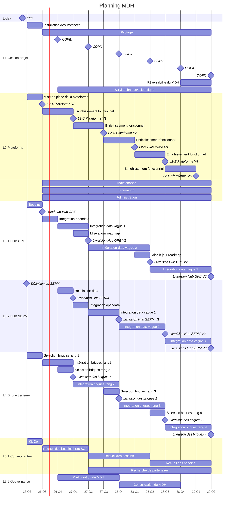

# test

```mermaid
gantt
    title Planning MDH
    dateFormat YYYY-MM-DD
    axisFormat %y-Q%q
    tickInterval 3month

    section today
        %% This task forces the chart to start at the beginning of the year
        now : milestone, m1, 2026-03-04, 0d

    section L1 Gestion projet
        Installation des instances           :a1, 2026-04-01, 3M
        Pilotage                             :2026-07-01, 33M
        COPIL                                :milestone, 2026-09-30, 1m
        COPIL                                :milestone, 2027-03-31, 1m
        COPIL                                :milestone, 2027-09-30, 1m
        COPIL                                :milestone, 2028-03-31, 1m
        COPIL                                :milestone, 2028-09-30, 1m
        COPIL                                :milestone, 2029-03-31, 1m
        Réversabilité du MDH                 :2028-10-01, 6M
        Suivi technique/scientifique         :2026-10-01, 30M

    section L2 Plateforme
        Mise en place de la plateforme       :2026-04-01, 3M
        L2-A Plateforme V0                   :milestone, 2026-07-01, 1m
        Enrichissement fonctionnel           :6M
        L2-B Plateforme V1                   :milestone, 2027-01-01, 1m
        Enrichissement fonctionnel           :6M
        L2-C Plateforme V2                   :milestone, 2027-07-01, 1m
        Enrichissement fonctionnel           :6M
        L2-D Plateforme V3                    :milestone, 2028-01-01, 1m
        Enrichissement fonctionnel           :6M
        L2-E Plateforme V4                   :milestone, 2028-07-01, 1m
        Enrichissement fonctionnel           :6M
        L2-F Plateforme V5                   :milestone, 2029-01-01, 1m
        Maintenance                          :2026-07-01, 33M
        Formation                            :2026-07-01, 33M
        Adminstration                        :2026-07-01, 33M

    section L3.1 HUB GPE
        Besoins                              :2026-04-01, 3M
        Roadmap Hub GPE                      :milestone, 2026-06-30, 1m
        Intégration opendata                 :2026-07-01, 3M
        Intégration data vague 1             :2026-10-01, 6M
        Mise à jour roadmap                  :2027-01-01, 3M
        Livraision Hub GPE V1                :milestone, 2027-03-31, 1m
        Intégration data vague 2             :2027-04-01, 12M
        Mise à jour roadmap                  :2028-01-01, 3M
        Livraision Hub GPE V2                :milestone, 2028-03-31, 1m
        Intégration data vague 3             :2028-04-01, 12M
        Livraision Hub GPE V3                :milestone, 2029-03-31, 1m

    section L3.2 HUB SERM
        Définition du SERM                   :milestone, 2026-03-29, 1m
        Besoins en data                      :2026-10-01, 3M
        Roadmap Hub SERM                     :milestone, 2026-12-31, 1m
        Intégration opendata                 :3M
        Intégration data vague 1             :6M
        Livraision Hub SERM V1               :milestone, 2027-09-30, 1m
        Intégration data vague 2             :9M
        Livraision Hub SERM V2               :milestone, 2028-06-30, 1m
        Intégration data vague 3             :9M
        Livraision Hub SERM V3               :milestone, 2029-03-31, 1m

    section L4 Brique traitement
        Sélection briques rang 1             :2026-04-01, 3M
        Intégration briques rang1            :6M
        Sélection briques rang 2             :2026-10-01, 3M
        Livraison des briques 1              :milestone, 2026-12-31, 1m
        Intégration briques rang 2           :9M
        Sélection briques rang 3             :2027-07-01, 3M
        Livraison des briques  2             :milestone, 2027-09-30, 1m
        Intégration briques rang 3           :9M
        Sélection briques rang 4             :2028-04-01, 3M
        Livraison des briques 3              :milestone, 2028-06-30, 1m
        Intégration briques rang 4           :2028-07-01, 9M
        Livraison des briques 4              :milestone, 2029-03-31, 1m

    section L5.1 Communautée
        Kit Com                              :2026-04-01, 3M
        Recueil des besoins  hors SGP        :9M
        Recueil des besoins                  :12M
        Recueil des besoins                  :12M
        Recherche de partenaires             :2027-04-01, 24M

    section L5.2 Gouvernance
        Préfiguration du MDH                 :2026-10-01, 12M
        Consolidation du MDH                 :2027-10-01, 12M      
```
