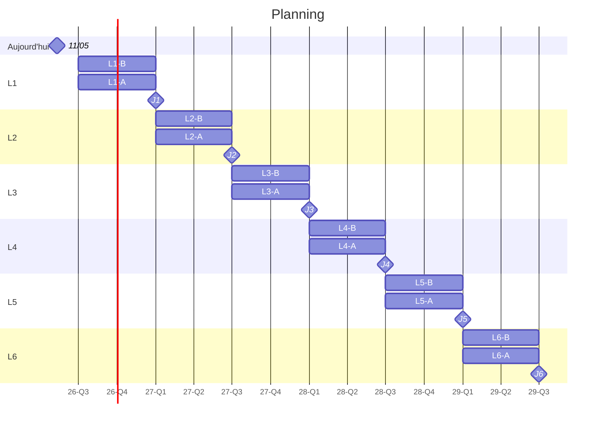

# Mobility Data Hub

```mermaid
gantt
    title Planning
    dateFormat YYYY-MM-DD
    axisFormat %y-Q%q
    tickInterval 3month

    section Aujourd'hui
        %% This task forces the chart to start at the beginning of the year
        11/05 : milestone, m1, 2026-05-11, 0d

    section L1
        L1-B                                 :2026-07-01, 6M
        L1-A                                 :2026-07-01, 6M
        J1                                   :milestone, 2027-01-01, 1m

    section L2
        L2-B                                 :2027-01-01, 6M
        L2-A                                 :2027-01-01, 6M
        J2                                   :milestone, 2027-07-01, 1m

    section L3
        L3-B                                 :2027-07-01, 6M
        L3-A                                 :2027-07-01, 6M
        J3                                   :milestone, 2028-01-01, 1m

    section L4
        L4-B                                 :2028-01-01, 6M
        L4-A                                 :2028-01-01, 6M
        J4                                   :milestone, 2028-07-01, 1m

    section L5
        L5-B                                 :2028-07-01, 6M
        L5-A                                 :2028-07-01, 6M
        J5                                   :milestone, 2029-01-01, 1m

    section L6
        L6-B                                 :2029-01-01, 6M
        L6-A                                 :2029-01-01, 6M
        J6                                   :milestone, 2029-07-01, 1m
        
```
